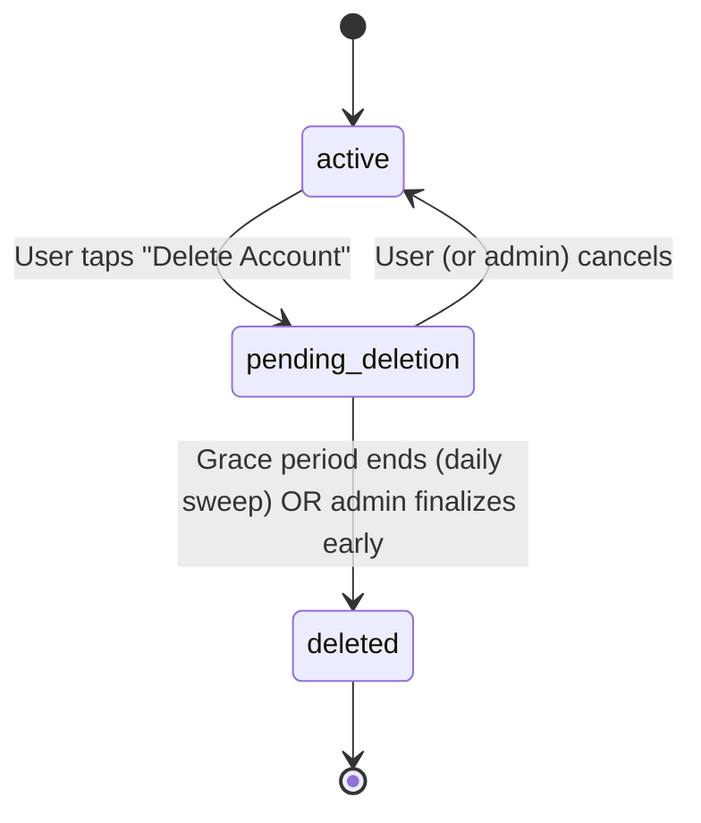

# React + Vite

This template provides a minimal setup to get React working in Vite with HMR and some ESLint rules.

Currently, two official plugins are available:

- [@vitejs/plugin-react](https://github.com/vitejs/vite-plugin-react/blob/main/packages/plugin-react) uses [Oxc](https://oxc.rs)
- [@vitejs/plugin-react-swc](https://github.com/vitejs/vite-plugin-react/blob/main/packages/plugin-react-swc) uses [SWC](https://swc.rs/)

## React Compiler

The React Compiler is not enabled on this template because of its impact on dev & build performances. To add it, see [this documentation](https://react.dev/learn/react-compiler/installation).

## Expanding the ESLint configuration

If you are developing a production application, we recommend using TypeScript with type-aware lint rules enabled. Check out the [TS template](https://github.com/vitejs/vite/tree/main/packages/create-vite/template-react-ts) for information on how to integrate TypeScript and [`typescript-eslint`](https://typescript-eslint.io) in your project.

# Account Deletion Flow — Patients & Doctors

This document explains how "Delete Account Permanently" works end-to-end,
for both patients and doctors, including the admin panel's ability to
override it. Written for a non-technical audience (client-facing).

## Design principle

We never hard-delete a Patient or Doctor document. Appointments,
Prescriptions, Transactions, and Reviews all hold a reference to that
document's ID, and medical/financial records must be retained for a minimum
period regardless of a user's delete request.

Instead, deletion is a two-step process:
1. **Soft delete** — the account is scheduled for deletion but the person
   stays logged in during a grace period, in case they change their mind.
2. **Anonymize** — once the grace period passes, personal data (name, email,
   phone, photo, etc.) is permanently scrubbed. The database row stays, so
   historical records still resolve, but nothing personally identifying
   remains.

## The three account states

| State | Meaning |
|---|---|
| `active` | Normal account. |
| `pending_deletion` | Deletion requested. Still logged in. Inside the grace period. Can be cancelled. |
| `deleted` | Grace period passed (or an admin finalized early). PII anonymized. Irreversible. |

---

## 1. Self-service flow (what the user experiences)

### Step 1 — Request deletion
The user goes to **Settings → Danger Zone → Delete Account** and confirms.

- Account status changes to `pending_deletion`.
- A deletion date is set: **today + 15 days** (the grace period).
- **Patient-specific:** all of their upcoming appointments are automatically
  cancelled, so doctors aren't left waiting on a patient who's leaving.
- **Doctor-specific:** the doctor is immediately pulled off the "book a
  doctor" list (`available = false`), so no new patients can book them.
  However, a doctor **cannot** request deletion while they have upcoming
  appointments — they must complete or cancel those first. This avoids
  stranding a patient mid-consultation or leaving a payout dispute unresolved.
- The user sees a message confirming the exact date their account will be
  permanently deleted, and is told they can cancel anytime before then.

### Step 2 — Grace period (up to 15 days)
The user stays fully logged in and can use the app normally, except:
- Doctors remain off the bookable list.
- Patients' upcoming appointments have already been cancelled.

If they tap **"Delete Account"** again during this window, they're simply
shown the existing scheduled date rather than starting a new request.

### Step 3a — User changes their mind (cancel)
The user goes back to Settings and cancels the deletion:
- Account status reverts to `active`.
- Doctors become bookable again (`available = true`).
- Nothing was ever lost — this is a full, clean undo.

### Step 3b — Grace period expires (finalize)
A background job runs once a day (and once at server boot) and checks for
any account whose scheduled deletion date has passed. For each one, it:
- Replaces name, email, phone, DOB, blood group, weight, and profile photo
  with anonymized placeholders (e.g. `"Deleted User"`, `deleted_<id>`).
- Sets account status to `deleted` and records the deletion timestamp.
- **Doctor note:** qualification, registration number, and verification
  documents are deliberately **not** scrubbed — that's the regulatory record
  of who was licensed to treat patients on the platform, not personal
  contact information. (This can be changed if your compliance stance
  requires full erasure instead.)

Once `deleted`, the process is irreversible through self-service — there is
no "undelete" for the user at this point.

---

## 2. Admin panel flow (support overrides)

Admins can see and manage the deletion lifecycle for every patient and
doctor from the admin panel, independently of the suspend/active status.

### Visibility
- Every patient/doctor row shows a second badge — **"Pending Deletion"**
  (orange) or **"Deleted"** (grey) — whenever the account isn't `active`.
- Two dedicated filter tabs, **Pending Deletion** and **Deleted**, let an
  admin pull up exactly those accounts.
- The detail view (eye icon) shows an **"Account Deletion"** section with
  the requested date, scheduled date, and (once deleted) the deletion date.

### Action 1 — Cancel a user's scheduled deletion
Used when, e.g., a patient contacts support saying "I changed my mind but
can't get back into the app" or a doctor asks support to undo it for them.
- Only available while status is `pending_deletion`.
- Admin clicks **"Cancel Deletion"** → confirms → account reverts to
  `active` (and for doctors, `available` is restored to `true`).
- The doctor is notified in-app that support cancelled it on their behalf.

### Action 2 — Force-finalize now ("Delete Now")
Used when, e.g., a user requested deletion and there's a legitimate reason
not to wait out the remaining grace period.
- Only available while status is `pending_deletion` — an admin cannot
  jump straight from `active` to `deleted`; the user (or another admin
  action) must have started the deletion request first. This guarantees the
  grace-period promise shown to the user was genuinely offered before any
  early finalization happens.
- Admin clicks **"Delete Now"** → confirms (marked as a destructive,
  irreversible action in the UI) → the same anonymization logic used by the
  daily background job runs immediately for that one account.
- This is a hard stop: there is no cancel after this point, for anyone.

### What admins cannot do
- Cannot delete an `active` account directly — deletion must always start
  as a request (self-service or a request relayed through support), never
  as a unilateral admin action on an untouched account.
- Cannot restore a `deleted` account — anonymization is permanent by design.

---

## API reference

| Actor | Method & Path | Effect |
|---|---|---|
| Patient | `POST /api/patient/account/delete` | Start grace period |
| Patient | `POST /api/patient/account/cancel-delete` | Self-cancel |
| Doctor | `POST /api/doctor/account/delete` | Start grace period |
| Doctor | `POST /api/doctor/account/cancel-delete` | Self-cancel |
| Admin | `PATCH /api/admin/patients/:id/cancel-deletion` | Cancel on user's behalf |
| Admin | `PATCH /api/admin/patients/:id/finalize-deletion` | Delete now (skip wait) |
| Admin | `PATCH /api/doctors/:id/cancel-deletion` | Cancel on user's behalf |
| Admin | `PATCH /api/doctors/:id/finalize-deletion` | Delete now (skip wait) |
| System | Daily background sweep | Auto-finalizes anyone past their scheduled date |

## Summary for the client

> "When someone deletes their account, they get a 15-day grace period during
> which they can change their mind — nothing is lost yet. If they don't
> cancel, the system automatically and permanently anonymizes their personal
> information after those 15 days, while keeping their appointment/medical/
> financial history intact for compliance. Support can step in at any point
> during that window to cancel the deletion for them, or — only once a
> deletion is already in progress — finalize it early if there's a good
> reason to. Nothing about this process can be reversed once an account is
> fully deleted."